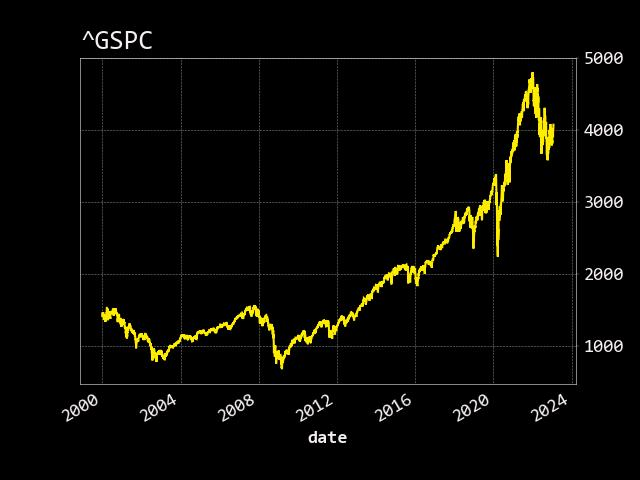
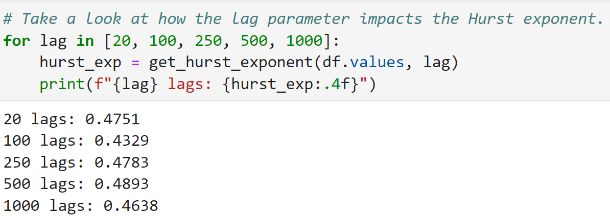
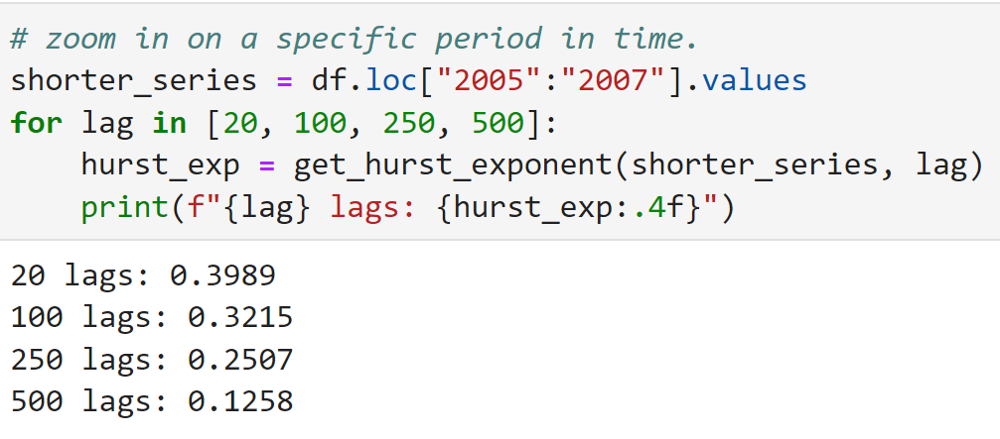

# Pick the right strategy with the Hurst Exponent

https://en.wikipedia.org/wiki/Hurst_exponent

Use the Hurst exponent to pick the right type of strategy for the market.

The Hurst exponent is a measure of the long-term memory of a time series. It quantifies the tendency of a time series to revert to its mean or cluster in one direction. The Hurst exponent shows if a time series behaves in a random, trending, or mean-reverting way. It captures the speed autocorrelation decrease as the lag increases.

And it’s great for trading.

Traders use it to pick the right trading strategy for the current market conditions. For example, you do not want to trade a trend strategy if the Hurst exponent shows mean reverting market behavior.

### Use the Hurst exponent for strategy selection

The Hurst exponent ranges between 0 and 1.

If the Hurst exponent is below 0.5, the market is mean reverting. Reversal strategies win in these markets.

If the Hurst exponent of 0.5 means the market is random. In this case, a trading strategy that relies on the market direction will lose money.

If the Hurst exponent is above 0.5 the market is trending. Markets with a high Hurst exponent are perfect for trend-following strategies.

Unfortunately, most traders will trade the same strategy through all markets. 

Use the Hurst exponent to pick the right strategy for the market.

---

Key Takeaways:

- Get stock price data

- Calculate the Hurst exponent

- Determine the type of market

- Here’s how to do it in Python, step by step.

---

Import Required Libraries

pandas 

numpy

Openbb

---

## Step 1: Get stock price data

Download 20 years of data and plot it, for this example, use the OpenBB SDK for data.

The trending and mean reverting periods are obvious when you inspect them visually. Though you can’t visually interpret every chart at every time frame.

But you can use the Hurst exponent.

---

## Step 2: Calculate the Hurst exponent

There are a few ways to calculate the Hurst exponent. You can estimate the rate of diffusion based on the variance of log prices

The Hurst exponent uses lags to measure the long-term memory of the time series. For each lag in the range, calculate the standard deviation of the differenced series. Then calculate the slope of the log lags versus the standard deviations. You can do this by returning the first value from NumPy’s polyfit function which fits a first-degree polynomial function.

## Step 3: Determine the type of market

Take a look at how the lag parameter impacts the Hurst exponent.

This will print the Hurst exponent at different lags. Over the entire time series, the S&P 500 is close to random. In the shorter lags, there is evidence of mean reversion.

Now, zoom in on a specific period in time.

Just as the Great Financial Crisis hit, the S&P 500 was mean reverting. In fact, with 500 lags, the Hurst exponent is close to 0.13.

---

### Closing

We reviewed how to use the Hurst exponent to pick the right strategy for the market. 

Now you can get stock price data, calculate the Hurst exponent, and determine the type of market to help select the right trading strategy.